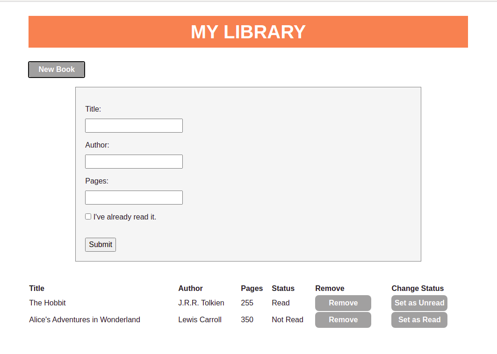

# My Library - Javascript

> A simple Library App, where the user can add books information and view the registered books. Developed using: HTML, CSS, and Javascript. 

### You can access a Live Demo [HERE](https://rawcdn.githack.com/MarilenaRoque/library/feature/building_app/index.html)

## Features Built

- Register new Books
- See Registered Books
- Remove Registered Books
- Change the status of registered books

## Built With

- HTML5
- CSS3
- Javascript

## Getting Started

To get a local copy up and running follow these simple steps.

- Clone this repository
 > `git clone <repo>`
- Navigate to the Repo Folder
- Use your favorite browser the index.html file (located at the root)
- Warning: This project use localStorage to store the books, be aware that the registered books will be only available on the browser it was registered.

## Authors

👤 **Marilena Roque**

- Github: [MarilenaRoque](https://github.com/MarilenaRoque)
- Twitter: [@MariRoq88285995](https://twitter.com/MariRoq88285995)
- Linkedin: [roquemarilena](https://www.linkedin.com/in/roquemarilena/)

## 🤝 Contributing

Contributions, issues and feature requests are welcome!

Feel free to check the [issues page](issues/).

## Show your support

Give a ⭐️ if you like this project!
